# -树莓派智能安防摄像头（Smart security camera for home use by Raspberry-Pi）
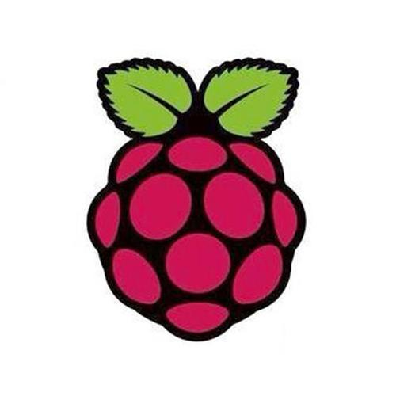
## -目录（Catalogue）

- [-描述（Description）](#-描述description)    
- [-详细功能（detailed function）](#-详细功能detailed-function)    
- [-为什么使用树莓派（Why Raspberry Pi?）](#-为什么使用树莓派why-raspberry-pi)    
- [- 如何使用（How to do）](#--如何使用how-to-do)        
    - [step1-准备工具（tool）](#step1-准备工具tool)        
    - [step2-配置Raspberry Pi（deploy）](#step2-配置raspberry-pideploy)        
    - [step3-测试相机（To test the camera）](#step3-测试相机to-test-the-camera)            

        - [1) 现在让我们用树莓派拍一张照片吧~](#1-现在让我们用树莓派拍一张照片吧)            
        - [2) 现在让我们用一段简单的代码测试一下吧](#2-现在让我们用一段简单的代码测试一下吧)        

    - [step4-移动物体目标检测（Moving object detection）](#step4-移动物体目标检测moving-object-detection)        
    - [step5-人脸检测（MTCNN）](#step5-人脸检测mtcnn)        
    - [step6-人脸识别（Face Recognition）](#step6-人脸识别face-recognition)        
    - [step7-定时录像（Regular mail）](#step7-定时录像regular-mail)        
    - [step8-非家庭成员入侵发邮件报警（Stanger call the police）](#step8-非家庭成员入侵发邮件报警stanger-call-the-police)        
    - [step9-ShuffleNet轻量级模型](#step9-shufflenet轻量级模型)    
- [-性能描述](#-性能描述)        


## -描述（Description）
		RPi-AI-Camera是一款智能AI摄像头，具有人形侦查预警器。
		通过识别移动的物体，抓取人脸图像对比家庭成员信息来判别出外人入侵的情况，从而做到邮件预警的功能
## -详细功能（detailed function）
 * 移动物体的追踪定位框选
 * 通过人脸识别技术，对非家庭成员入侵邮件预警预警
 * 实时录像以减轻内存负担
 * 对摔倒行为发送警告邮件
  
  
  **GitHub仓库：**  [yuaaaaaa/RPi-AI-CAMERA](https://github.com/yuaaaaaa/RPi-AI-CAMERA.git)
  
## -为什么使用树莓派（Why Raspberry Pi?）
树莓派是一个只有信用卡大小的微型电脑，可以完成各种任务，基于他体型小的特点，可以用于家用微型摄像仪的载体。
这款Linux系统的计算机可以在低耗的情况下完成各种预期功能。
[了解更多](https://baike.so.com/doc/6240059-6453436.html)
## - 如何使用（How to do）
### step1-准备工具（tool）
* **硬件设备**
 * 树莓派（Raspberry-Pi）
 * 树莓派搭载摄像头（Raspberry Pi camera module）
* **软件设备**
 * Python3
 * openCV

### step2-配置Raspberry Pi（deploy）
* 确认openCV模块安装
```
进入Raspberry Pi命令界面
进入Python编译器 
>> python
测试opencv模块是否安装成功
>> import cv2
```
安装成功就可以进入下一步啦，如果出现了错误[点击这里](https://blog.csdn.net/kyokozan/article/details/79192646)
* 确认camera模块启动
```
// 尝试以下命令
ls -al /dev/ | grep video
// 当看到'video0 device'时表明摄像头模块已启动
```

### step3-测试相机（To test the camera）
#### 1) 现在让我们用树莓派拍一张照片吧~
```
// 拍摄一张照片 并命名为image.jpg存到本地
raspistill -o image.jpg
```
#### 2) 现在让我们用一段简单的代码测试一下吧
首先打开你的树莓派编译器，然后输入以下代码
```py
import cv2
cap = cv2.VideoCapture(0)
// 设置窗口的宽和高
cap.set(3,640)
cap.set(4,480)
while(True):
    ret, frame = cap.read()
    if ret:
        gray = cv2.cvtColor(frame, cv2.COLOR_BGR2GRAY)
        cv2.imshow('frame', frame)
        cv2.imshow('gray', gray)
        k = cv2.waitKey(30) & 0xff
    if k == 27: # press 'ESC' to quit
        break
cap.release()
cv2.destroyAllWindows()
```
执行以上代码以后会出现两个运行窗口，frame和gray
在这里我们添加gray窗口是为了后续便于方便计算
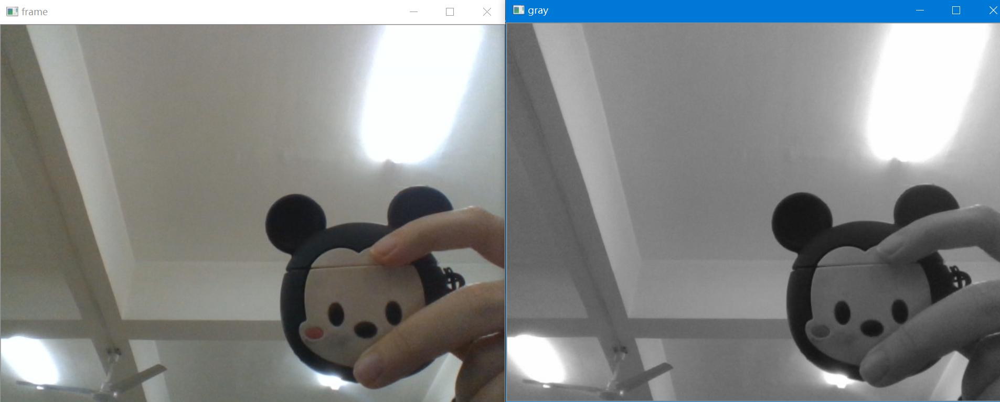
### step4-移动物体目标检测（Moving object detection）
[代码仓库地址](https://github.com/yuaaaaaa/RPi-AI-CAMERA/blob/main/Project/%E9%99%88%E9%9B%A8%E6%99%B4/%E8%BF%90%E5%8A%A8%E7%89%A9%E4%BD%93%E6%A3%80%E6%B5%8B%E6%A1%86%E9%80%89.ipynb)
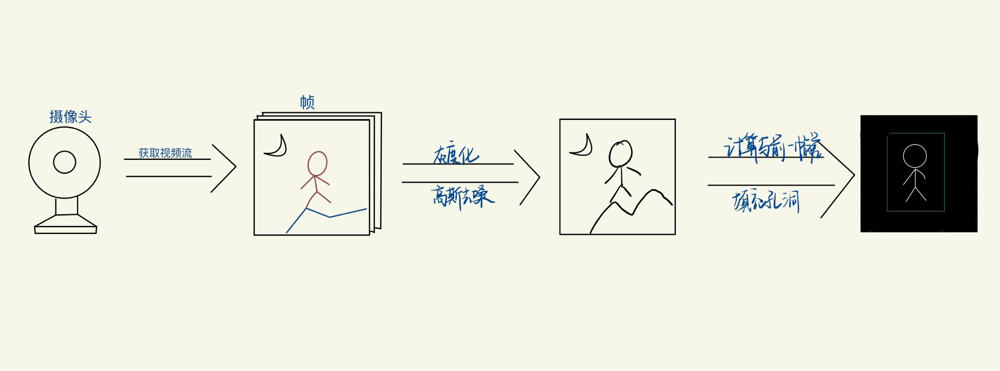

**tips：**
 * 高斯模糊

高斯模糊是一种广泛使用的图形软件的方法，通常会减少图像噪声和减少细节,适用于很多的场合和情景；
高斯模糊的核心就是取中心点周围所有像素点的均值作为自己的像素值，以此来达到平滑效果；
在本例中使用高斯模糊对的原因：每个输入的视频都会因自然震动、光照变化或者摄像头本身等原因而产生噪声。对噪声进行平滑是为了避免在运动和跟踪时将其检测出来。 

 * 二值化阈值处理

二值化阈值处理就是将图像上的像素点的灰度值设置为0或255，也就是将整个图像呈现出明显的只有黑和白的视觉效果。
在本例中对于每个从背景之后读取的帧都会计算其与背景之间的差异，并得到一个差分图（different map），
还需要应用阈值来得到一幅黑白图像，并通过下面代码来膨胀（dilate）图像，
从而对孔（hole）和缺陷（imperfection）进行归一化处理。

### step5-人脸检测（MTCNN-多任务卷积神经网络）
[代码仓库地址](https://github.com/yuaaaaaa/Raspberry-FaceRecognition-SecurityCamera/blob/main/Project/net/mtcnn.py)

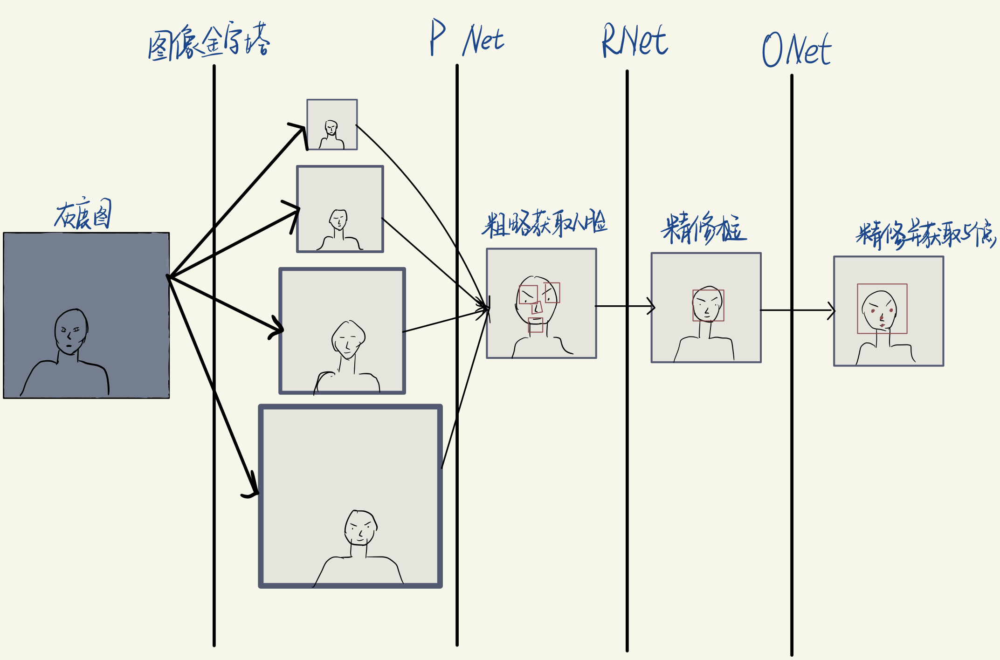
**tips:**

* P-Net:构造是一个全卷积网络,这一部分的基本思想是使用较为浅层、较为简单的CNN快速生成人脸候选窗口。
* R-Net:构造是一个卷积神经网络增加了一个全连接层,相对于P-Net更复杂的网络结构来对P-Net生成的可能是人脸区域区域窗口进行进一步选择和调整，从而达到高精度过滤和人脸区域优化的效果。

* O-Net:基本结构是一个较为复杂的卷积神经网络，相对于R-Net来说多了一个卷积层.使用更复杂的网络对模型性能进行优化.

### step6-人脸识别（Face Recognition）
[数据集：该数据集包含了来自500个人的2500张亚洲人脸图片，非限制场景下的人脸识别。提取码：o0ty](http://pan.baidu.com/s/1bpIvkLp)

[代码仓库地址](https://github.com/yuaaaaaa/Raspberry-FaceRecognition-SecurityCamera/blob/main/Project/net/inception.py)

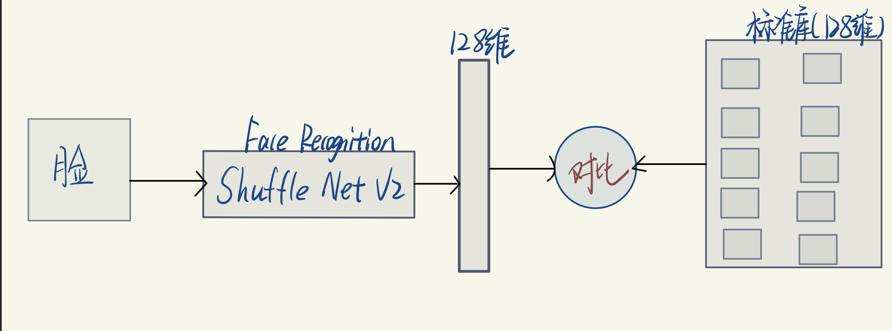
**tips:**

* 通过ShuffleNet卷积神经网络将检测到的人脸图像转换为128维人脸特征向量，与标准库内已知家庭人脸进行比对。

### step7-定时录像（Regular mail）
[代码仓库地址](https://github.com/yuaaaaaa/RPi-AI-CAMERA/blob/main/Project/%E8%AE%B8%E4%BA%A6%E6%9D%A8/%E5%AE%9E%E7%8E%B0%E5%BD%95%E5%83%8F.ipynb)
```python
import cv2
import numpy as np


cap = cv2.VideoCapture(0)

#创建VideoWrite对象，10是fps（每秒读取的帧数），(640,480)是屏幕大小
fourcc = cv2.VideoWriter_fourcc(*'XVID')
out = cv2.VideoWriter('./cameraoutput.avi', fourcc, 25, (640,480))

video_len = 250
if cap.isOpened():
    while(video_len>0):
        '''
            cv2.VideoCapture(0).read()
                功能：读取一帧的图片
                参数：无
                返回值：1.（boolean值）是否读取到图片
                        2.一帧图片
        '''
        ret, frame = cap.read()
        #保存写入这一帧图像frame:
        out.write(frame)
        #显示这一帧图像frame:
        cv2.imshow("capture", frame)
        #当按下'q'键时退出：
        if cv2.waitKey(1) & 0xFF == ord('q'):
            break
        video_len -= 1


cap.release()
out.release()
cv2.destroyAllWindows()
```
**tip:**
* 定时录像

当画面静止时间超过6s时，该摄像系统将不再录像记录，以达到节省本地内存的优点

### step8-非家庭成员入侵发邮件报警（Stanger call the police）
[代码仓库地址](https://github.com/yuaaaaaa/RPi-AI-CAMERA/blob/main/Project/%E8%AE%B8%E4%BA%A6%E6%9D%A8/%E9%82%AE%E4%BB%B6%E5%8F%91%E9%80%81%EF%BC%88%E6%91%84%E5%83%8F%E5%A4%B4%E6%8B%8D%E6%91%84%E7%85%A7%E7%89%87%E5%8F%91%E9%80%81%EF%BC%89.ipynb)
```python
"""
Created on Sun Nov 29 17:16:14 2020

@author: 32991
"""

import cv2
import smtplib
import sys
import os
import time
from email.mime.image import MIMEImage
from email.mime.multipart import MIMEMultipart
from email.mime.text import MIMEText

#设置参数：
smtpserver  = '3299115821@qq.com'     # smtp服务器
username    = '3299115821@qq.com'     # 发件邮箱账号
password    = 'ndudpbtzsczddcac'             # 邮箱登录密码
sender      = '3299115821@qq.com'     # 发件人
addressee   = '3299115821@qq.com'     # 收件人
exit_count  = 10                       # 尝试联网次数
path        = os.getcwd()             #获取图片保存路径 
'''
    os.getcwd() 方法
        用于返回当前工作目录，无参数
'''

#构造邮件内容：
def setMsg():     # 下面依次为邮件类型，主题，发件人和收件人。
    msg = MIMEMultipart('mixed') 
    msg['Subject'] = '出现非家庭成员！'
    msg['From'] = '3299115821@qq.com <3299115821@qq.com>'
    msg['To'] = addressee

    text = "主人，出现非家庭成员！照片如下！"     # 下面为邮件的正文
    text_plain = MIMEText(text, 'plain', 'utf-8')
    msg.attach(text_plain)

    sendimagefile = open(path+'/person.jpg', 'rb').read()     # 构造图片链接
    image = MIMEImage(sendimagefile)
    image["Content-Disposition"] = 'attachment; filename="people.png"'     # 下面一句将收件人看到的附件照片名称改为people.png。
    msg.attach(image)
    return msg.as_string()

#实现邮件发送：
def sendEmail(msg):
    #发送邮件
    smtp = smtplib.SMTP()
    smtp.connect('smtp.qq.com')
    smtp.login(username, password)
    smtp.sendmail(sender, addressee, msg)
    smtp.quit()
    
msg = setMsg()
sendEmail(msg)
```

**效果渲染**

```邮件接收```

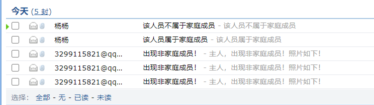

```不属于家庭成员情况```

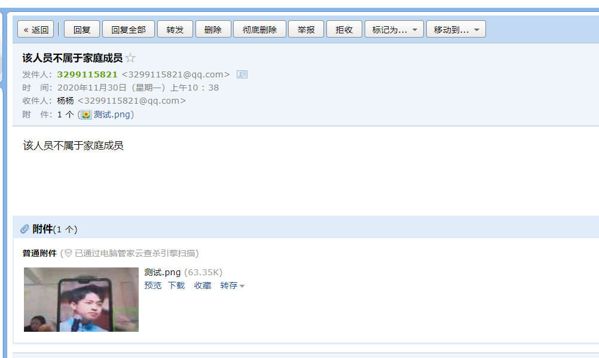

```属于家庭成员情况```

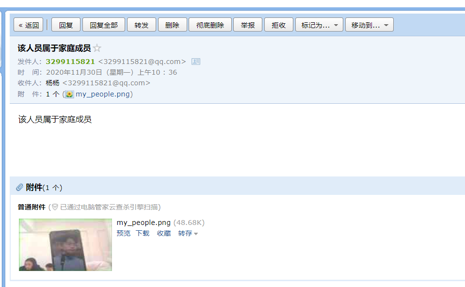

```确认为家庭成员```

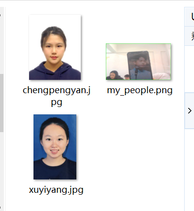

### step9-ShuffleNet轻量级模型
[代码仓库](https://github.com/yuaaaaaa/Raspberry-FaceRecognition-SecurityCamera/blob/main/Project/net/ShuffleNet2.py)

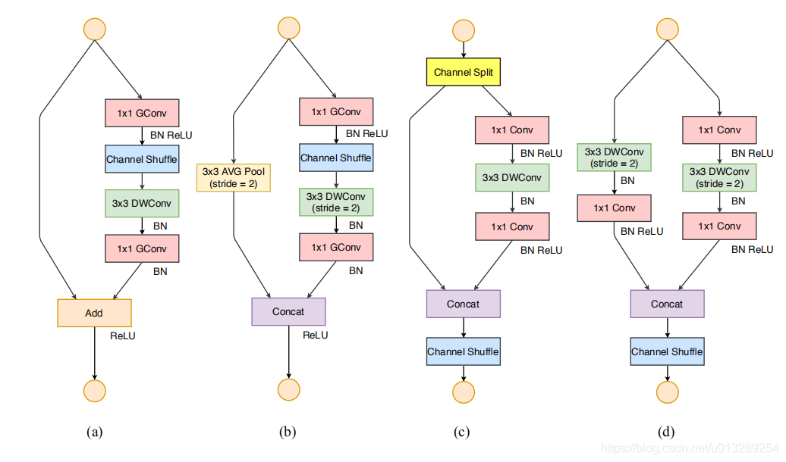
**tips:**
* GConv :组卷积，减少计算量
* 3*3 DWConv(S = 2)：步长为2的深度可分离卷积，减少计算量
* Concat ：连接层
* Channel Shuffle:来增强通道之间的相关性


### step9-摔倒识别（canny 边缘检测）
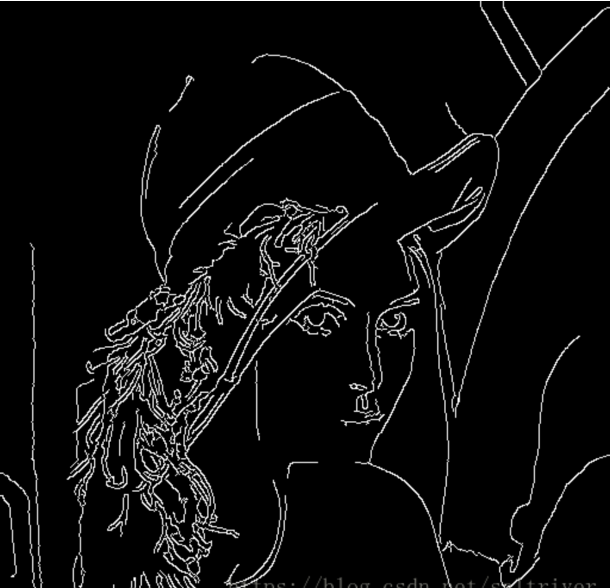

**tips:**

* 使用高斯滤波器，平滑图像，除燥
* 计算像素点的梯度强度和方向
* 应用非极大值抑制，消除边缘检测带来的杂散响应
* 应用双阈值检测来确定真实的边缘 推荐高低阈值比 T2/T1 =3:1 or2:1
* 通过抑制孤立的弱边缘，来最终完成边缘检测
* 根据人体比例判断状态：Walking，Falling，Fallen


## -性能描述

|             | 移动物体识别 | 人脸识别 | 邮件发送 | 定时录像 | 摔倒识别 |
|-------------| ---------- | ------- | ------ | ------- | ------- |
|联想 YOGA i7 8G| 31.27 | 49.98 | 1564.65 | 3732.48 | 78.74 |
|Raspberry ZeroW| 93.81 | 149.94 | 1428.20 | 22.18 | 198.63 |

